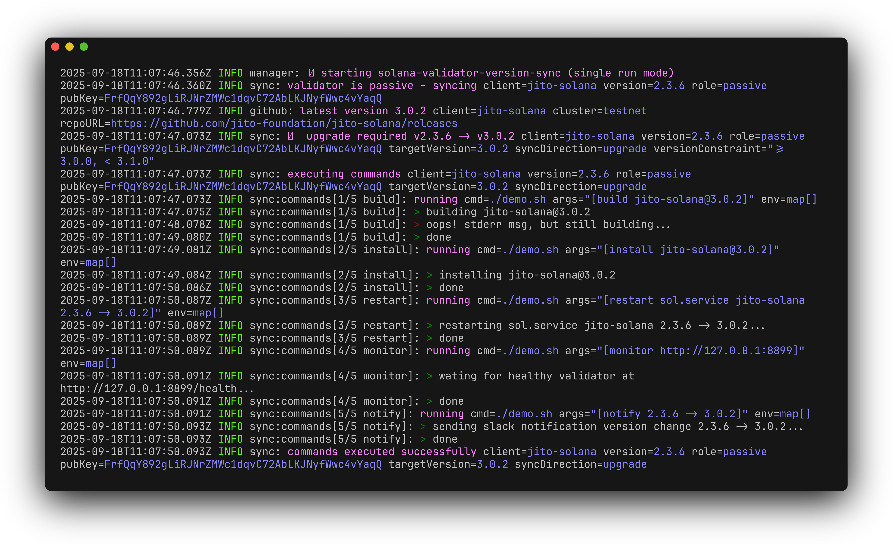

# solana-validator-version-sync
[](https://opensource.org/licenses/MIT)

A simple version synchronization manager for Solana validators, including [SFDP](https://solana.org/delegation-program) compliance.




## Features

- 👀 **Version Monitoring**: Continuously monitors the validator's current running version compared to latest available releases.
- 👮 **SFDP Compliance**: Checks version requirements against SFDP (Solana Foundation Delegation Program) bounds.
- ♻️ **Sync Commands**: Executes configurable commands when a version sync for the given validator client is required.
- ⌚ **Single-shot or recurring**: Run once or on a specified interval
- ✅ **Multiple Clients**: Supports [agave](https://github.com/anza-xyz/agave), [jito-solana](https://github.com/jito-foundation/jito-solana/), and [firedancer](https://github.com/firedancer-io/firedancer) validator client release monitoring.

## Installation

### From Source

```bash
git clone https://github.com/sol-strategies/solana-validator-version-sync.git
cd solana-validator-version-sync
make build
```

### Download pre-built binary

Download the latest release from the [Releases page](https://github.com/sol-strategies/solana-validator-version-sync/releases).

## Usage

### Run Once

```bash
solana-validator-version-sync --config config.yaml run
```

### Run Continuously

```bash
# can run this command as a systemd service
solana-validator-version-sync --config config.yaml run --on-interval 1h
```

## Configuration

Create a configuration file (e.g., `config.yml`) with the following options (see [config.yml](config.yml) for a working example):

```yaml
log:
  level: info  # optional, default: info, one of debug|info|warn|error|fatal
  format: text # optional, default: text, one of text|logfmt|json

validator:
  client: agave                          # required, one of agave|bam-client|jito-solana|firedancer
  version_constraint: ">= 2.3.6, < 3.0.0" # required, a valid go-version semver constraint string - ref https://github.com/hashicorp/go-version
  rpc_url: http://127.0.0.1:8899         # optional, default: http:127.0.0.1:8899 - local validator rpc URL
  identities:
    active: local-test/active-identity.json   # required - path to validator active keypair
    passive: local-test/passive-identity.json # required - path to validator passive keypair

cluster:
  name: testnet # required - one of mainnet-beta|testnet

sync:
  # Run sync commands even when the validator is active
  # Use with care, usually only for testnet.
  enabled_when_active: false # default: false

  # Ensure the target version satisfies SFDP requirements as reported by the API:
  # https://api.solana.org/api/epoch/required_versions
  enable_sfdp_compliance: true # default: false

  # Commands to run when there is a version change. They will run in the order they are declared.  
  # cmd, args, and environment values can be template strings and will be interpolated with the following variables:
  #  .ClusterName                 cluster the validator is running on
  #  .CommandIndex                index of the command in the commands array (zero-based)
  #  .CommandsCount               count of commands in the commands array
  #  .SyncIsSFDPComplianceEnabled true|false (value of sync.enable_sfdp_compliance)
  #  .ValidatorClient             client name (value of validator.client)
  #  .ValidatorIdentityPublicKey  public key of the validator's identity as reported by .ValidatorRPCURL
  #  .ValidatorRole               active|passive
  #  .ValidatorRoleIsActive       true|false
  #  .ValidatorRoleIsPassive      true|false
  #  .ValidatorRPCURL             RPC URL of the validator (value of validator.rpc_url)
  #  .VersionFrom                 current running version as reported by .ValidatorRPCURL
  #  .VersionTo:                  sync target version
  commands:
    - name: "build"                                      # required - vanity name for logging purposes
      allow_failure: false                               # optional, default:false - when true, errors are logged and subsequent commands executed
      stream_output: true                                # optional, default: false - when true, command output streamed
      disabled: false                                    # optional, default: false - when true, command skipped
      cmd: /home/solana/scripts/build-solana.sh          # required, supports templated string
      args: ["build", "--client={{ .ValidatorClient }}"] # optional, supports templated strings
      environment:                                       # optional, environment variables to pass to cmd, values support templated strings
        TO_VERSION: "{{ .VersionTo }}"
    # ...
```

## Development

### Prerequisites

- Go 1.25 or later
- Make
- Docker (for Docker development)

### Local Development

```bash
# Build and run locally
make build
make dev

# Build for all platforms
make build-all

# Run tests
make test

# Clean build artifacts
make clean
```

### Docker Development

```bash
# Start development environment with Docker Compose
make dev-docker

# Stop development environment
make dev-docker-stop

# Build Docker image
make docker-build
```

## License

This project is licensed under the MIT License - see the LICENSE file for details.
